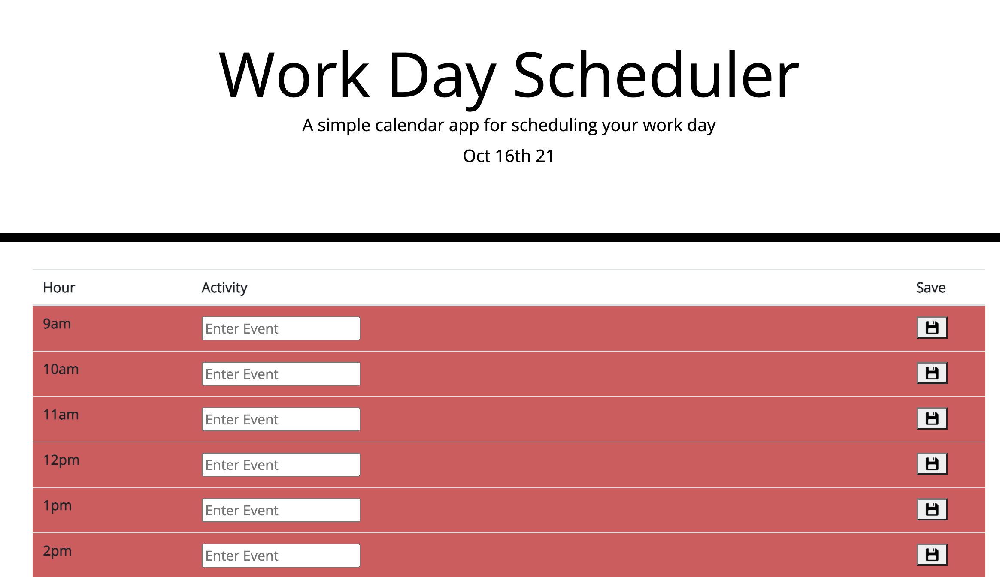

# calendar
* As a developer, I created a daily planner web application that logs activities to be done within the standard business hours (9am to 5pm) of the specific day that the application is being used.

## About the Project
This project utilizes moment.js to log the current date and to color code the hourly time blocks based on whether they are past, present or future. The user will be able to save events entered in a specific time block to their local storage.

## Screenshot
Here is a sample image of how the planner application appears:

## Getting Started

Enter the following link to access the code repository:

https://github.com/vbmisra/calendar

Enter the following link to access the planner application:

https://vbmisra.github.io/calendar/